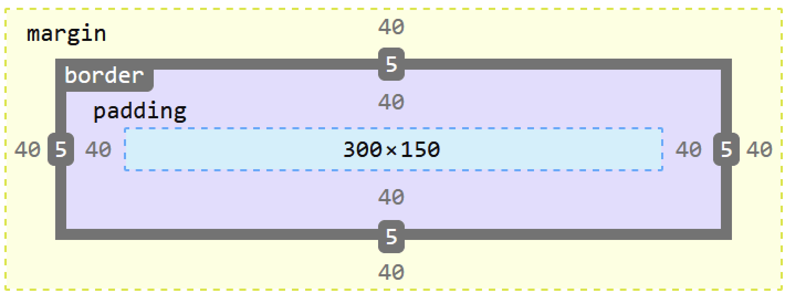

# Frontend assessment


## HTML/CSS knowledge check
### Please ​give a brief description of the Box Model​:
"Box Model" is a terminology when talking about design & layout of HTML Element. Every HTML element in CSS has a box around it, there are 2 main type
of boxes: Inline Boxes & Block Boxes. The full CSS Box Model is applying to Block Boxes including parts that made the Block Box:
- Content: the content of the box
- Padding: the white space around content that added up to the box's size
- Border: the border wraps around content & padding and added up to the box's size & where the box's area stops
- Margin: outter white space between the box and other elements and is not counted towards the box' size, only added to the total space the box is taken up

    

## JS exercise

```js
const sales = [
    { itemSold: "Football", price: 19.99, dateSold: "2018-04-07", id: "j_123" },
    { itemSold: "Trainers", price: 159.95, dateSold: "2018-03-02", id: "t_acds1" },
    { itemSold: "Cricket bat", price: 204.97, dateSold: "2018-04-05", id: "j_456"},
    { itemSold: "Rugby ball", price: 30.00, dateSold: "2017-04-22", id: "t_acds3" },
    { itemSold: "Hockey stick", price: 54.95, dateSold: "2017-03-19", id: "j_999" }
];

/* 
* Return the sum of the price of all properties as a single value.
* avoid using float to handle money : https://husobee.github.io/money/float/2016/09/23/never-use-floats-for-currency.html
* Expected Result: 469.86
*/
const priceSum = sales.reduce((accumulator, currentValue) => (accumulator*100 + (currentValue.price ? currentValue.price : 0)*100)/100, 0);
console.log(priceSum);

/* 
* Return the items which were sold in 2017.
* Expected Result:
* [
*    {
*        "itemSold": "Rugby ball",
*        "price": 30,
*        "dateSold": "2017-04-22",
*        "id": "t_acds3"
*    },
*    {
*        "itemSold": "Hockey stick",
*        "price": 54.95,
*        "dateSold": "2017-03-19",
*        "id": "j_999"
*    }
* ]
*/
const soldItems = sales.filter(sale => new Date(sale.dateSold).getFullYear() === 2017);
console.log(soldItems) 


/* 
* Return an array of all of the itemsSold properties as strings, sorted alphabetically.
* Expected Result: ["Cricket bat", "Football", "Hockey stick", "Rugby ball", "Trainers"]
*/
const itemSoldArr = sales.map(sale => sale.itemSold).sort((a,b) =>  a < b ? -1 : Number(a > b));
console.log(itemSoldArr);

/* 
* Using id as an argument, return the sale which matches the id.
* Expected Result:
* {
*    "itemSold": "Cricket bat",
*    "price": 204.97,
*    "dateSold": "2018-04-05",
*    "id": "j_456"
* }
*/
const saleByID = (id) => {
    return sales.find( sale => sale.id.toString() === id.toString());
};
const exampleID = saleByID("j_123");
console.log(exampleID); 

```

## Replicate layout

### Technical Decision:
- Project is developed with [React App](https://github.com/facebook/create-react-app) & TypeScript based on the timeframe & complexity of the requirements:
    - create-react-app handles webpack config + hot reload + code splitting + bundling for production build for a light weight web app
    - TypeScript for static type checking, IntelliSense, support for common library and better for code readibilty
- Project is using tsconfig & prettier for linting & code formatting to maintain code standards
- Project came with customised vscode config for easier local set up
- the UI is developed based on Atomic design systems with a tweak to minimised the complexicity (elements -> components -> templates)
- BEM is used for CSS naming system following[Harry Robert's BEM standards](https://csswizardry.com/2013/01/mindbemding-getting-your-head-round-bem-syntax/)
- CSS important standards are reinfoced using stylint

| Stylint Rules                                                                                               | Auto-formattted                                                                            |
| --------------------------------------------------------------------------------------------------- | ------------------------------------------------------------------------------------------ |
| [stylelint-config-idiomatic](https://github.com/ream88/stylelint-config-idiomatic-order#readme)     | Yes                                                                                        |
| [stylelint-selector-bem-pattern](https://github.com/simonsmith/stylelint-selector-bem-pattern)      | No - only warning if the block is definded using `/** @define [component-name] */`         |
| empty line between class block                                                                      | Yes                                                                                        |  |
| max 2 nesting within a block & only allow staring with `&` & mixin function                         | No - warning only           

- Based on the complexity of the app, jest snapshot test is used for lightweight & fast tests runs focus on UI components rendering

### Design decisions:
- Color theme has been modified for better accessibilty (passed contrast checker) to support color-blind users
- Side Navigation takes up a lot of space based on the requirements, so has been modified to be able to minimised/expanded - boost user interaction, provide better user expersion on small screen devices
- Button & input field are implemented with focus state to support keyboard accessibilty (TabIndex)
- Implemented fallback for fontsize using SASS @mixin to support older browsers, root font is hard code to 16px to make sure not reverted to 14px for some mobile browsers
- Implemented padding unit & margin unit system for flexibily in the future when changing design of the components/layout